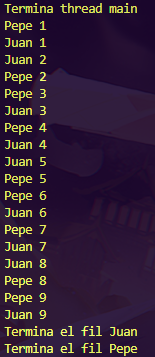
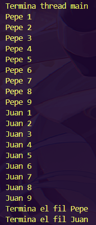
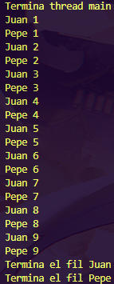

# 01-Fils

Comportament 1
======================
Per fer el primer comportament, a la classe Principal he instanciat de Fil Juan i Pepe, he fet que utilitzin el mètode start() i un println per indicar que termina el thread main. Després, a la classe Fil, he fet un String privat, un constructor de fil amb l'String i he fet el mètode run(), que recorre 9 i indica el nom del fil, i dins del bucle he posat un mètode sleep(1000) per a ralentitzar els subprocessos.

Principal.java:
```java
public class Principal {
    public static void main(String[] args) {
        Fil juan = new Fil("Juan");
        Fil pepe = new Fil("Pepe");

        juan.start();
        pepe.start();

        System.out.println("Termina thread main");   
    }
}
```
Fil.java:
```java
public class Fil extends Thread {
    private String name;

    public Fil(String name) {
        this.name = name;
    }

    @Override
    public void run() {
        for (int i = 1; i <= 9; i++) {
            System.out.println(name + " " + i);
            try {
                // Pausa per simular un comportament més realista
                Thread.sleep(1000); 
            } catch (InterruptedException e) {
                e.printStackTrace();
            }
        }
        System.out.println("Termina el fil " + name);
    }
}
```

Resultat:



Comportament 2
=========================
Pel que fa al segon comportament, he modificat la classe Principal.java per tal de que comenci el fil Pepe primer primer, i es fa un try/catch amb un join per esperar que acabi el fil Pepe, i quan ja s'ha acabat el fil Pepe, es fa exactament el mateix amb el fil Juan. A més, he posat els missatges dels fils Pepe i Juan a Principal.java i he tret el missatge a Fil.java, per tal de que apareguin al final de tot.

Principal.java:
```java
public class Principal {
    public static void main(String[] args) {

        Fil juan = new Fil("Juan");
        Fil pepe = new Fil("Pepe");

        System.out.println("Termina thread main");

        // Inicialitzar el fil Pepe primer
        pepe.start();

        try {
            // Esperar a que Pepe acabi
            pepe.join();
        } catch (InterruptedException e) {
            e.printStackTrace();
        }

        // Després inicialitzar el fil Juan
        juan.start();

        try {
            // Esperar a que Juan acabi
            juan.join();
        } catch (InterruptedException e) {
            e.printStackTrace();
        }
        //Indicar que els fils Pepe i Juan han acabat
        System.out.println("Termina el fil Pepe");
        System.out.println("Termina el fil Juan");
    }
}

```
Fil.java:
```java
public class Fil extends Thread {
    private String name;

    public Fil(String name) {
        this.name = name;
    }

    @Override
    public void run() {
        for (int i = 1; i <= 9; i++) {
            System.out.println(name + " " + i);
            try {
                // Pausa per simular un comportament més realista
                Thread.sleep(1000); 
            } catch (InterruptedException e) {
                e.printStackTrace();
            }
        }
    }
}
```
Resultat:



Comportament 3
==================
Per fer el terçer comportament, el codi de la classe Principal.java l'he deixat com estava al primer comportament. Després, a la classe Fil.java, he creat un Object lock i un boolean isJuanTurn, on (dins del mètode run) es sincronitza l'objecte lock i es fa un bucle segons el nom i si es isJuanTurn, que té lock.wait(), per a que l'objecte esperi al seu torn, i quan ja té el seu torn, imprimeix el missatge, cambia el torn i utilitza lock.notifyAll() per notificar a l'altre fil per indicar que és el seu torn.

Principal.java:
```java
public class Principal {
    public static void main(String[] args) {
        Fil juan = new Fil("Juan");
        Fil pepe = new Fil("Pepe");

        juan.start();
        pepe.start();

        System.out.println("Termina thread main");   
    }
}
```
Fil.java:
```java
public class Fil extends Thread {
    private String name;
    private static final Object lock = new Object();
    private static boolean isJuanTurn = true; // Comienza Juan

    public Fil(String name) {
        this.name = name;
    }

    @Override
    public void run() {
        for (int i = 1; i <= 9; i++) {
            synchronized (lock) {
                while ((name.equals("Juan") && !isJuanTurn) || (name.equals("Pepe") && isJuanTurn)) {
                    try {
                        Thread.sleep(1000);
                        lock.wait(); // Espera el seu torn
                    } catch (InterruptedException e) {
                        e.printStackTrace();
                    }
                }
                // Imprimeix el missatge
                System.out.println(name + " " + i);
                isJuanTurn = !isJuanTurn; // Cambia el torn
                lock.notifyAll(); // Notifica a l'altre fil
            }
        }
        System.out.println("Termina el fil " + name);
    }
}
```
Resultat:

