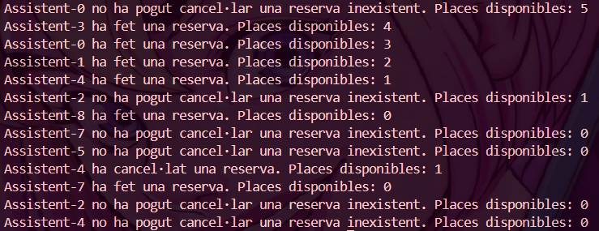
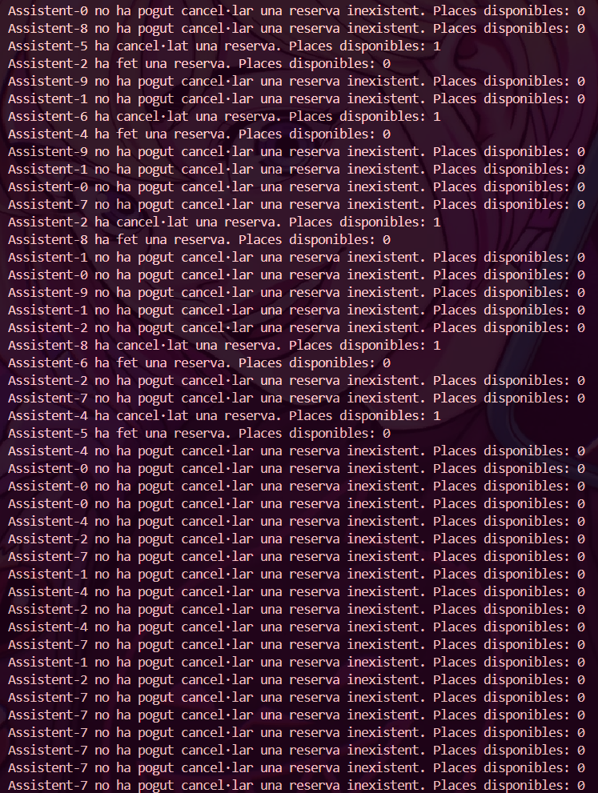

# PREGUNTES TEÒRIQUES

## 1. Per què s'atura l'execució al cap d'un temps?

Perquè no queden places disponibles i els fils que intenten fer reserves es bloquegen i entren en l'estat d'espera amb el *wait()* fins que es cancel·la una reserva i es notifica amb el *notifyAll()*. Si no hi cancel·lació de reserves, els fils queden permanent en espera i llavors sembla que l'execució s'ha aturat.

## 2. Què passaria si en lloc de una probabilitat de 50%-50% fora de 70% (ferReserva)-30% (cancel·lar)? I si foren al revés les probabilitats? → Mostra la porció de codi modificada i la sortida resultant en cada un dels 2 casos

### 70% ferReserva - 30% cancel·lar

```java
// 70% de reserva i 30% de cancel·lar
@Override
public void run() {
    while (true) {
        try {
            Thread.sleep(random.nextInt(1000));
            if (random.nextInt(100) < 70) {
                esdeveniment.ferReserva(this);
            } else {
                esdeveniment.cancelaReserva(this);
            }
        } catch (InterruptedException e) {
            Thread.currentThread().interrupt();
        }
    }
}
```


### 30% ferReserva - 70% cancel·lar
```java
//30% de reserva i 70% de cancel·lar
    @Override
    public void run() {
        while (true) {
            try {
                Thread.sleep(random.nextInt(1000));
                if (random.nextInt(100) < 30) {
                    esdeveniment.ferReserva(this);
                } else {
                    esdeveniment.cancelaReserva(this);
                }
            } catch (InterruptedException e) {
                Thread.currentThread().interrupt();
            }
        }
    }
```


## 3. Perquè creus que fa falta la llista i no valdria només amb una variable sencera de reserves?

La llista d'assistents és necessària degut a que s'ha d'identificar quins assistents en específic han fet reserves i gestionar-les. Si no hi hagués la llista d'assistents no podríem saber quin assistent té quina reserva i les cancel·lacions podrien ser inconsistents i no respetar la lògica del sistema.